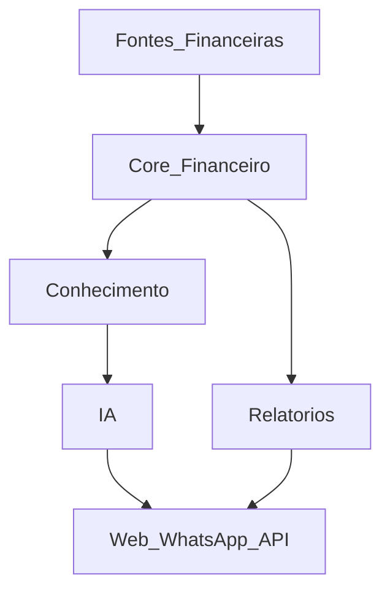

# 00 — Visão da arquitetura

Porta de entrada da documentação do LançAI. Leia este documento primeiro; ele leva a todos os outros.

Este conjunto numerado é a **única fonte da verdade** do projeto. Os documentos anteriores estão em [`_historico/`](_historico/) apenas para consulta.

---

## 1. O que é o LançAI

Não é um app de “lançar gasto no WhatsApp”. É uma **Plataforma de Inteligência Financeira** que:

1. **Centraliza** movimentações de qualquer origem.
2. **Preserva o Fato Financeiro** vindo da instituição como verdade imutável.
3. **Constrói Conhecimento** sobre esses fatos: categoria, pessoa, PF ou PJ, tags, regras.
4. **Aprende** com a conversa e com as correções feitas na interface.
5. Expõe essa inteligência por **Web**, **WhatsApp** e **API**.

O banco informa que saiu R$ 340 para um CNPJ. Só o usuário sabe que era o marketing da empresa, cobrável do cliente, do projeto Itália. **Essa segunda metade é o produto.**

---

## 2. Os dois pilares invariantes

Nenhuma feature futura pode quebrar estas duas regras. Elas **são** a arquitetura.

### Pilar 1 — Fato Financeiro e Conhecimento do LançAI são separados

| | **Fato Financeiro** | **Conhecimento do LançAI** |
|---|---|---|
| O que é | O que a instituição informou | O que sabemos sobre aquilo |
| Campos | valor, data, conta, descrição de origem, identificador da transação | categoria, pessoa, perfil, tags, observações, quem classificou |
| Mutabilidade | **Imutável** quando vem de instituição | **Sempre mutável** |
| Quem escreve | Somente o Core, a partir de uma Fonte Financeira | Usuário, regras, IA |

O extrato nunca muda porque a IA achou algo. Ver [ADR-009](adr/009-fato-vs-conhecimento.md).

### Pilar 2 — Open Finance é apenas uma Fonte Financeira

O Core **nunca** conhece o provedor. Toda origem entrega o mesmo objeto interno. Trocar de provedor deve significar mexer em um módulo só. Ver [ADR-011](adr/011-open-finance-isolado.md).

---

## 3. Princípio organizador

O centro do sistema não é o WhatsApp, nem o Open Finance, nem o Web. É o **Core Financeiro**. Todo o resto é periferia conectada a ele.

Fontes e canais dependem do Core. O Core não depende de ninguém.

E a filosofia que governou a última revisão, que vale para qualquer proposta futura:

> A melhor arquitetura é a mais simples possível, desde que não impeça a evolução futura.

Antes de adicionar módulo, camada ou serviço, a pergunta é: isso resolve um problema real dos próximos 12 a 24 meses, ou apenas deixa a arquitetura mais sofisticada? Ver [ADR-014](adr/014-seis-modulos-sem-infra-nova.md).

---

## 4. Mapa da documentação

### Quero saber…

| Pergunta | Documento |
|---|---|
| O que cada termo significa, rápido | [04-GLOSSARIO.md](04-GLOSSARIO.md) |
| Como nomear tabela, classe ou função | [01-DOMINIO.md](01-DOMINIO.md) |
| O que é o produto e para quem | [05-PRD.md](05-PRD.md) |
| Como os módulos se conectam | [02-ARQUITETURA.md](02-ARQUITETURA.md) |
| Onde mexer para uma tarefa específica | [03-MODULOS.md](03-MODULOS.md) |
| Que colunas e tabelas existem | [07-MODELO_DE_DADOS.md](07-MODELO_DE_DADOS.md) |
| Qual o formato de uma intenção ou interface | [08-CONTRATOS.md](08-CONTRATOS.md) |
| Como o saldo é calculado, como corrigir difere de excluir | [09-REGRAS_DE_NEGOCIO.md](09-REGRAS_DE_NEGOCIO.md) |
| Como uma frase se torna uma intenção | [10-IA.md](10-IA.md) |
| Como o assistente funciona (web + WhatsApp, ponta a ponta) | [16-ASSISTENTE.md](16-ASSISTENTE.md) |
| Como será o cockpit | [11-WEB.md](11-WEB.md) |
| Como o assistente se comporta no WhatsApp | [12-WHATSAPP.md](12-WHATSAPP.md) |
| Como a sincronização bancária funciona | [13-OPEN_FINANCE.md](13-OPEN_FINANCE.md) |
| Como rodar os testes e o que cobrir | [14-TESTES.md](14-TESTES.md) |
| Variáveis de ambiente, deploy, cron | [15-OPERACAO.md](15-OPERACAO.md) |
| O que vem quando | [06-ROADMAP.md](06-ROADMAP.md) |
| Por que uma decisão foi tomada | [adr/](adr/README.md) |

### Trilhas de leitura

- **Primeiro dia no projeto:** 00, 04, 01, 02.
- **Vai implementar a fase F1:** 07, 08, 09.
- **Vai mexer na conversa:** 16, 10, 09, 08.
- **Vai implementar Open Finance:** 13, 08, 07.
- **Vai construir o Web:** 11, 09, 08.
- **Vai colocar no ar:** 15, 14.

---

## 5. Estado atual e alvo

Seis módulos, dos quais dois ainda não existem:

| Módulo | Estado |
|---|---|
| `financeiro` | Existe, com ingestão e imutabilidade |
| `conhecimento` | Existe (F3): regras, IA, virar regra, hábitos (`Memoria`) |
| `open-finance` | Existe (F2) |
| `ia` | Existe e está maduro |
| `relatorios` | Existe |
| `evolution` | Existe |

O `apps/web` atual é um MVP de chat e será substituído. Detalhes em [03-MODULOS.md](03-MODULOS.md) e [06-ROADMAP.md](06-ROADMAP.md).

---

## 6. Como manter esta documentação

Três regras, e a primeira é a que evita a degradação:

1. **Cada informação vive em exatamente um arquivo.** Os outros linkam. Se dois documentos começarem a repetir conteúdo, o certo é fundir, não sincronizar.
2. **Cada documento declara no topo o que não cobre**, com link para onde ir.
3. **Decisão difícil de reverter gera ADR.** Escolha de biblioteca ou refatoração local, não.

Onde falta informação, existe um `TODO:` explícito. Isso é deliberado: significa “ainda não foi decidido”, não “alguém esqueceu”. Preencher um TODO exige decisão, não suposição.
