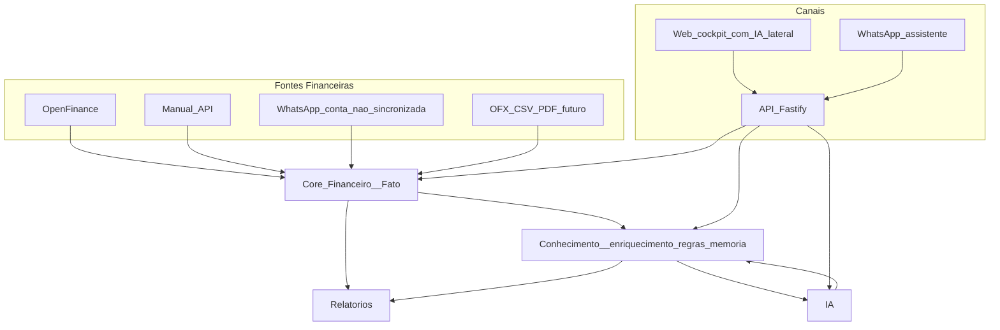
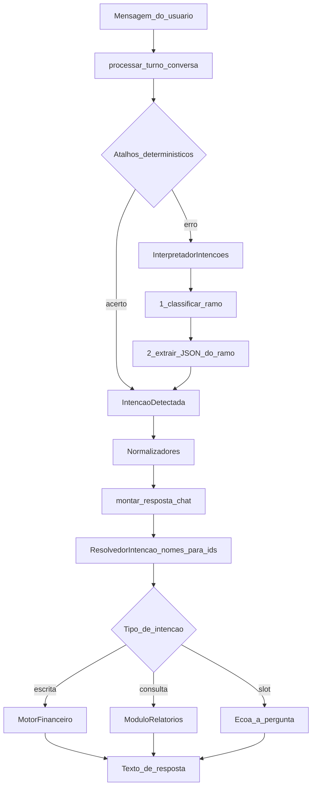
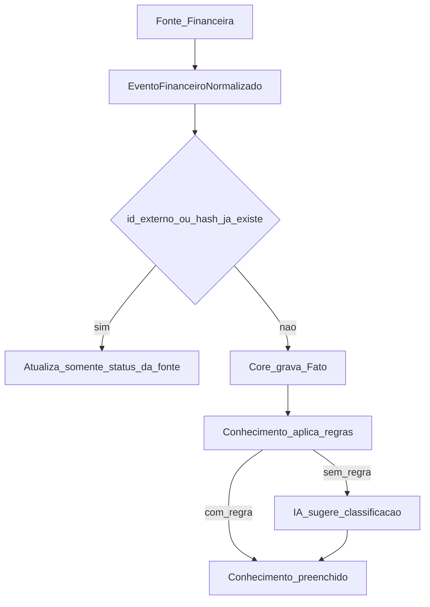

# 02 — Arquitetura

A arquitetura concreta: como os módulos se relacionam, por onde os dados passam e o que foi deliberadamente deixado de fora.

**Este documento não cobre:** a responsabilidade detalhada de cada módulo e seus arquivos — ver [03-MODULOS.md](03-MODULOS.md). Os pilares e a visão de produto — ver [00-VISAO_DA_ARQUITETURA.md](00-VISAO_DA_ARQUITETURA.md). Interfaces em código — ver [08-CONTRATOS.md](08-CONTRATOS.md).

---

## 1. Diagrama e direção de dependência

A regra, sem exceção: **fontes e canais dependem do Core; o Core não depende de ninguém.**

Nenhum módulo periférico escreve no ledger por fora do Core, e nenhum módulo periférico depende diretamente de outro. Ver a regra de ouro das importações em [08-CONTRATOS.md](08-CONTRATOS.md).

---

## 2. Camadas do turno de conversa

Esta é a arquitetura interna do caminho conversacional, e ela não é negociável: cada camada tem um único trabalho.

| Camada | Responsabilidade | O que não faz |
|---|---|---|
| Atalhos sem LLM | Reconhecer padrões óbvios sem custo de token | Regras de saldo ou limite |
| `InterpretadorIntencoes` | Classificar o ramo e extrair a intenção | Validar negócio, inventar identificador |
| Normalizadores | Defaults, enxugar descrição, slot-filling | Persistência |
| `ResolvedorIntencao` | Nomes para identificadores, ambiguidade, confirmação | Cálculo financeiro |
| `MotorFinanceiro` | Criar e corrigir movimentos, saldo, auditoria | Interpretar linguagem natural |
| `ModuloRelatorios` | Agregar leituras | Formatar o tom de voz, que fica na API |

Detalhamento passo a passo em [10-IA.md](10-IA.md).

---

## 3. Fluxos de dados

### 3.1 Ingestão — idêntica para toda fonte

O ponto do desenho: adicionar OFX, CSV ou um novo provedor bancário no futuro não altera nada depois da primeira caixa.

### 3.2 Open Finance

1. O Web pede à API as fontes disponíveis, obtém um token de conexão e abre o widget do provedor ativo.
2. O módulo de Open Finance guarda a conexão e o mapa de conta externa para conta local, e marca a conta como sincronizada.
3. O cron dispara o sync; as transações viram evento normalizado com `fatoImutavel` verdadeiro.
4. O Core grava o Fato. Regras e IA preenchem apenas Conhecimento.

O sync **nunca** roda dentro do turno de conversa.

### 3.3 WhatsApp em conta sincronizada

1. O usuário diz “esse PIX foi pessoal”, “o fornecedor é José Silva” ou “isso é do projeto Itália”.
2. A IA localiza o Fato existente por data, valor e descrição, apresentando lista numerada quando houver ambiguidade.
3. Grava somente Conhecimento, e pode oferecer transformar aquilo em regra.
4. Tentativa de criar ou apagar o Fato recebe recusa explicada.

### 3.4 WhatsApp em conta não sincronizada

Registro normal, como hoje, com fonte `whatsapp` e Fato mutável, usando o mesmo Conhecimento e as mesmas regras.

### 3.5 Assistente no Web

Painel lateral persistente em qualquer tela, com as mesmas intenções e o mesmo Core. O usuário pergunta ou afirma sem sair da tela em que está.

### 3.6 Aprendizado de regra

O usuário classifica algo, o assistente oferece transformar em regra, e a aceitação cria a regra e registra na memória.

---

## 4. Simplificações conscientes

Decisões tomadas na revisão de simplicidade da arquitetura, registradas com justificativa. Quem quiser reverter alguma precisa contra-argumentar a razão, não apenas preferir o contrário.

| Considerado | Decisão | Por quê |
|---|---|---|
| `modulos/fontes` separado | Entrada de ingestão dentro de `financeiro`; contrato em `pacotes/tipos` | O pipeline é fino; o desacoplamento vem do contrato, não de um pacote |
| `enriquecimento`, `regras` e `memoria` separados | Um módulo `conhecimento` | Espelha a separação Fato/Conhecimento e reduz três pacotes a um |
| `modulos/notificacoes` | Serviço em `apps/api` | Existe um único canal de alerta hoje |
| `modulos/jobs` com Redis e BullMQ | Endpoint de cron com agendador externo | Sync horário não exige fila; menos infraestrutura para operar |
| `modulos/workspace` | Coluna `workspace_id` e tabela de membros | Workspace é escopo de dados, não módulo |
| `modulos/importadores` como esqueleto | Criado quando OFX e CSV entrarem no roadmap | Pasta vazia é dívida, não preparação |
| Tabela separada de enriquecimento (1:1) | Uma tabela com dois grupos de colunas | Evita join em todo relatório; a invariante fica mais forte, não mais fraca |

---

## 5. Fora de escopo

Registrado nominalmente para não ser reintroduzido por hábito nem copiado de projeto de referência:

- Event bus interno
- Framework de plugins
- Microsserviços
- Redis ou fila dedicada
- Multi-moeda e conversão de câmbio
- Investimentos, metas, grupos e divisão de despesas, patrimônio avançado
- Tabela separada de enriquecimento e mecanismo próprio de versionamento
- Módulos vazios criados “de preparação”

Cada um deles está em [06-ROADMAP.md](06-ROADMAP.md) como evolução futura, com a condição concreta que o destravaria. Ver [ADR-014](adr/014-seis-modulos-sem-infra-nova.md).

---

## 6. Stack tecnológica

| Camada | Escolha |
|---|---|
| Frontend | React, Vite, TypeScript, Tailwind CSS, componentes no estilo shadcn/ui |
| Backend | Node.js, Fastify, TypeScript |
| Orquestração de IA | Vercel AI SDK, com providers para Google, Groq, OpenAI e compatível para OpenRouter e Ollama |
| Banco | Supabase Postgres com Drizzle ORM |
| Monorepo | pnpm workspaces |
| Contratos e validação | Zod, em `pacotes/tipos` |
| Testes | Vitest |
| WhatsApp | Evolution API |
| Infraestrutura | Docker, Coolify, VPS Hostinger, Caddy |

A arquitetura é agnóstica a provedor de LLM ([ADR-004](adr/README.md)) e a provedor de Open Finance ([ADR-011](adr/011-open-finance-isolado.md)).

Configuração, variáveis de ambiente e deploy em [15-OPERACAO.md](15-OPERACAO.md).
