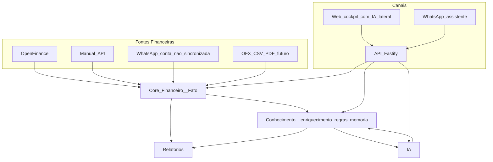
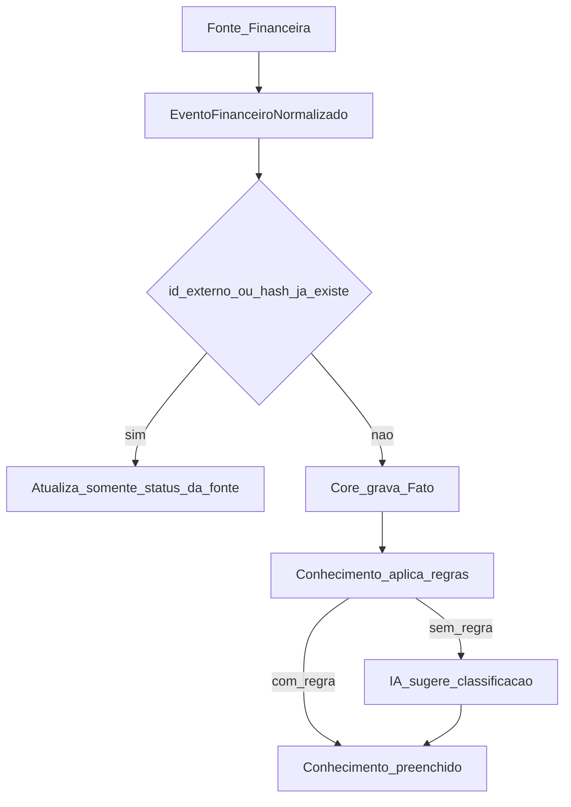

# Arquitetura — LançAI como Plataforma de Inteligência Financeira

> ## ⚠️ DOCUMENTO SUBSTITUÍDO
>
> As decisões deste documento **continuam vigentes**, mas o texto foi redistribuído no conjunto numerado em [`docs/`](../00-VISAO_DA_ARQUITETURA.md). Consulte lá, não aqui.
>
> - Pilares e visão: [00-VISAO_DA_ARQUITETURA.md](../00-VISAO_DA_ARQUITETURA.md)
> - Arquitetura e fluxos: [02-ARQUITETURA.md](../02-ARQUITETURA.md)
> - Módulos: [03-MODULOS.md](../03-MODULOS.md)
> - Modelo de dados: [07-MODELO_DE_DADOS.md](../07-MODELO_DE_DADOS.md)
> - Contratos: [08-CONTRATOS.md](../08-CONTRATOS.md)
> - Open Finance: [13-OPEN_FINANCE.md](../13-OPEN_FINANCE.md)
> - Roadmap, riscos e evoluções futuras: [06-ROADMAP.md](../06-ROADMAP.md)
> - ADR-009 a 014, agora com contexto e alternativas: [adr/](../adr/README.md)
>
> Mantido apenas para consulta histórica. Não atualizar.

O texto original começa aqui.

Filosofia que guiou esta revisão:

> A melhor arquitetura é a mais simples possível, desde que não impeça a evolução futura.

Todo item aqui passou por um filtro único: **resolve um problema real dos próximos 12 a 24 meses?** O que não passou está na seção 15 (Evoluções Futuras), documentado mas fora da arquitetura atual.

---

## 0. Glossário

Termos obrigatórios em qualquer conversa, PR ou issue do projeto.

| Termo | Definição |
|---|---|
| **Fato Financeiro** | O que a instituição financeira informou: valor, data, conta/cartão, descrição original, favorecido original, identificador da transação, status na fonte. Quando vem de instituição, é **imutável**. |
| **Conhecimento do LançAI** | Tudo que o LançAI ou o usuário sabe *sobre* um Fato: categoria, pessoa relacionada, PF/PJ, tags, observações, quem classificou, confiança da IA. Sempre **mutável**. |
| **Fonte Financeira** | Qualquer origem de movimentação. Toda fonte entrega o mesmo `EventoFinanceiroNormalizado` ao Core. Open Finance é *uma* fonte, não o centro. |
| **Core Financeiro** | `modulos/financeiro`. Único componente com autoridade para gravar Fato. Não conhece provedor, canal nem IA. |
| **Conta sincronizada** | Conta/cartão vinculado a uma conexão de Open Finance. É a flag que define o comportamento do WhatsApp. |
| **Workspace** | Escopo de dados que agrupa usuários, contas, cartões e conhecimento. Permite meu CPF, CPF do sócio e o CNPJ compartilharem a mesma inteligência. Anglicismo aceito como termo de domínio, como `chat` e `status`. |
| **Enriquecer** | Escrever Conhecimento sobre um Fato existente. É o único tipo de escrita permitido à IA e ao WhatsApp em conta sincronizada. |

---

## 1. Visão do produto

O LançAI não é um app de “lançar gasto no WhatsApp”. É uma **Plataforma de Inteligência Financeira** que:

1. **Centraliza** movimentações de qualquer origem.
2. **Preserva o Fato Financeiro** vindo da instituição como verdade imutável.
3. **Constrói Conhecimento** sobre esses fatos.
4. **Aprende** com a conversa e com as correções feitas no Web.
5. Expõe essa inteligência por **Web**, **WhatsApp** e **API**.

O centro do sistema é o **Core Financeiro**. WhatsApp, Open Finance, Web, relatórios e notificações são periferia conectada a ele.

---

## 2. Os dois pilares invariantes

Estas regras não podem ser quebradas por nenhuma feature futura. Elas **são** a arquitetura.

### Pilar 1 — Fato Financeiro vs Conhecimento do LançAI

| | **Fato Financeiro** | **Conhecimento do LançAI** |
|---|---|---|
| O que é | O que a instituição informou | O que o LançAI/usuário sabe sobre aquilo |
| Campos | `valor`, `data_movimento`, `conta_id`/`cartao_id`, `descricao_fonte`, `favorecido_fonte`, `id_externo`, `status_fonte` | `categoria_id`, `pessoa_id`, `perfil`, `tags`, `observacoes`, `classificado_por`, `confianca_ia`, `ignorado_em_relatorio` |
| Mutabilidade | **Imutável** quando `fonte = 'open_finance'` | **Sempre mutável** |
| Quem escreve | Somente o Core, a partir de uma Fonte Financeira | Usuário, motor de regras, IA |
| Quem nunca escreve | IA, WhatsApp, Web | — |

O banco fornece o fato. O LançAI fornece o significado. É essa separação que torna o produto confiável: o extrato nunca “muda porque a IA achou”.

### Pilar 2 — Open Finance é apenas uma Fonte Financeira

- O Core **nunca** conhece Pluggy nem qualquer outro provedor.
- Toda origem entrega o **mesmo** `EventoFinanceiroNormalizado`.
- Trocar de provedor = alterar somente `modulos/open-finance`.
- O Web **não** tem provedor hardcoded: pergunta à API quais fontes estão ativas e renderiza o widget do provedor retornado.
- O campo `provedor` é um **rótulo opaco**: o Core armazena e nunca interpreta.

---

## 3. Crítica da arquitetura atual

### Onde estamos

Monorepo TypeScript com `apps/api` + `apps/web` (chat MVP), `modulos/{financeiro,ia,relatorios,memoria,evolution}` e `pacotes/{banco,tipos}`. Toda entrada é linguagem natural, o `MotorFinanceiro` é o único writer, e não existe Open Finance, fonte, workspace nem separação entre fato e conhecimento.

### Problemas que justificam a evolução

| Problema | Impacto real |
|---|---|
| Linguagem natural como fonte de verdade | Vai colidir com o extrato bancário: duplicata e dado incompleto |
| `movimento` totalmente editável | Impossível proteger o dado vindo do banco |
| WhatsApp como digitador | Fricção alta e redundante quando o banco sincroniza |
| Ausência de motor de regras | Depende de LLM em cada turno: custo e classificação inconsistente |
| `memoria` como chave/valor raso | Não sustenta pessoas, fornecedores e aprendizado real |
| Web chat-only | Não suporta conexão bancária, extrato nem regras |
| API gorda | Toda feature nova engorda o turno de conversa |

### O que preservar sem tocar

`MotorFinanceiro` e sua porta de repositório; o pipeline conversacional já maduro (atalhos determinísticos, ramos de intenção, slot-filling curto, desambiguação numerada); `modulos/evolution` como transporte fino; `modulos/relatorios` somente leitura; contratos Zod em `pacotes/tipos`; multi-provedor de IA via `OrquestradorIA`; append-only com `auditoria`.

---

## 4. Nova arquitetura



Direção de dependência, sem exceção: **fontes e canais dependem do Core; o Core não depende de ninguém.**

### Módulos

```text
apps/
  api/            # composition root: HTTP, auth, webhooks, endpoints de cron
  web/            # NOVO React: cockpit + painel de IA lateral
modulos/
  financeiro/     # Core: Fato, saldos, parcelas, auditoria + entrada de ingestão
  conhecimento/   # Enriquecimento + regras + memória (o "saber" do LançAI)
  open-finance/   # Provedores (Pluggy primeiro). Isolado. Trocável.
  ia/             # Interpretação de linguagem natural + leitura/enriquecimento
  relatorios/     # Leituras e agregações
  evolution/      # Transporte WhatsApp
pacotes/
  tipos/          # Contratos Zod/TS, incluindo FonteFinanceira
  banco/          # Schema Drizzle / Supabase
```

Seis módulos. A estrutura de pastas espelha o Pilar 1: `financeiro` é o Fato, `conhecimento` é o Conhecimento.

### Simplificações conscientes

Decisões tomadas na revisão de simplicidade, com a justificativa registrada para não serem revertidas por hábito:

| Considerado | Decisão | Por quê |
|---|---|---|
| `modulos/fontes` separado | Entrada de ingestão dentro de `financeiro`; contrato em `pacotes/tipos` | O pipeline é fino; o desacoplamento vem do contrato, não de um pacote |
| `enriquecimento`, `regras` e `memoria` separados | Um módulo `conhecimento` | Espelha o Pilar 1 e reduz três pacotes a um |
| `modulos/notificacoes` | Serviço em `apps/api` | Existe um único canal de alerta hoje |
| `modulos/jobs` com Redis/BullMQ | Endpoint de cron + agendador externo | Sync horário não exige fila; menos infraestrutura para operar |
| `modulos/workspace` | Coluna `workspace_id` + tabela de membros | Workspace é escopo de dados, não módulo |
| `modulos/importadores` como esqueleto | Criado somente quando OFX/CSV entrar no roadmap | Pasta vazia é dívida, não preparação |
| Tabela separada de enriquecimento (1:1) | Uma tabela `movimento` com dois grupos de colunas | Evita join em todo relatório; a invariante é garantida de forma mais forte (seção 8) |

---

## 5. Responsabilidades

| Módulo | Faz | Nunca faz |
|---|---|---|
| **financeiro** (Core) | Recebe `EventoFinanceiroNormalizado`, deduplica, grava Fato, recalcula saldo, gera parcelas, registra auditoria | Conhecer provedor, categorizar, falar com canal |
| **conhecimento** | Enriquecimento, motor de regras, memória, aprendizado por conversa | Alterar valor, data, conta ou descrição de origem |
| **open-finance** | Conexão, sync, mapa de contas externas, payload bruto e settings do provedor | Aplicar regra de negócio, escrever conhecimento |
| **ia** | Interpretar, consultar, propor classificação, pedir confirmação, sugerir regra | Criar, alterar ou excluir Fato de conta sincronizada |
| **relatorios** | Agregar Fato + Conhecimento | Escrever |
| **evolution** | Enviar e receber mensagem | Domínio |
| **apps/api** | Auth, rotas, webhooks, cron, alertas | Regra de domínio pesada |
| **apps/web** | Cockpit + assistente lateral | Lógica financeira |

---

## 6. Fluxo dos dados

### 6.1 Ingestão — idêntica para toda fonte



### 6.2 Open Finance

1. O Web pede à API as fontes disponíveis, obtém um token de conexão e abre o widget do provedor ativo.
2. `open-finance` guarda a conexão e o mapa conta externa → conta local, e marca a conta como `sincronizada`.
3. O cron dispara o sync; as transações viram `EventoFinanceiroNormalizado` com `fato_imutavel: true`.
4. O Core grava o Fato. Regras e IA preenchem apenas Conhecimento.

O sync **nunca** roda dentro do turno de conversa.

### 6.3 WhatsApp em conta sincronizada

1. Usuário: *“esse PIX foi pessoal”*, *“o fornecedor é José Silva”*, *“isso é do projeto Itália”*.
2. A IA localiza o Fato existente por data, valor e descrição — lista numerada quando houver ambiguidade.
3. Grava somente Conhecimento e pode oferecer transformar aquilo em regra.
4. Tentativa de criar ou apagar o Fato recebe recusa explicada: *“Esse lançamento veio do banco. Posso classificar e complementar, mas não criar nem apagar.”*

### 6.4 WhatsApp em conta não sincronizada

Registro normal, como hoje (`fonte = 'whatsapp'`, Fato mutável), com o mesmo Conhecimento e as mesmas regras.

### 6.5 Assistente no Web

Painel lateral persistente em qualquer tela, com as mesmas intenções da IA e o mesmo Core. Perguntar *“quanto gastei em restaurantes?”* ou afirmar *“esse PIX foi pessoal”* sem sair da tela.

### 6.6 Aprendizado de regra

O usuário classifica algo. A IA pergunta se deve virar regra (`IFOOD → Restaurantes`). Se sim, cria a regra e registra na memória. Uma regra **nunca** sobrescreve classificação feita pelo usuário — é o que `classificado_por` garante.

---

## 7. Contratos entre módulos

### 7.1 Fonte Financeira

```ts
export type TipoFonte =
  | "open_finance"
  | "manual"
  | "whatsapp"
  | "api"
  | "recorrencia"
  | "ofx"
  | "csv"
  | "pdf"; // reservados; sem implementação agora

export interface EventoFinanceiroNormalizado {
  workspaceId: string;
  fonte: TipoFonte;
  /** Rótulo opaco ("pluggy"). O Core armazena e nunca interpreta. */
  provedor?: string;
  /** Identificador da instituição ou hash do arquivo importado. */
  idExterno: string | null;
  ocorridoEm: string; // YYYY-MM-DD
  valor: number;
  tipo: "receita" | "despesa" | "transferencia";
  descricaoFonte: string;
  favorecidoFonte?: string;
  contaExternaId?: string;
  cartaoExternoId?: string;
  statusFonte?: "confirmado" | "pendente";
  /** true em open_finance: o Core passa a recusar alteração do Fato. */
  fatoImutavel: boolean;
}

export interface FonteFinanceira {
  id: string;
  coletar(workspaceId: string): Promise<EventoFinanceiroNormalizado[]>;
}
```

### 7.2 Core e Conhecimento — o Pilar 1 vira código

```ts
// modulos/financeiro
export interface CoreFinanceiro {
  ingerir_eventos(eventos: EventoFinanceiroNormalizado[]): Promise<ResultadoIngestao>;
  criar_fato_manual(entrada: EntradaFatoManual): Promise<Fato>;
  /** Recusa com erro de domínio quando o fato é imutável. */
  corrigir_fato_manual(id: string, campos: CamposFatoManual): Promise<Fato>;
}

// modulos/conhecimento
export interface ServicoConhecimento {
  atualizar(movimentoId: string, dados: ConhecimentoMovimento): Promise<void>;
  aplicar_regras(movimentoId: string): Promise<void>;
  criar_regra_a_partir_de_correcao(movimentoId: string): Promise<Regra>;
}
```

Nenhum método do Core aceita categoria ou tag. Nenhum método de Conhecimento aceita valor, data ou conta. A separação é **estrutural**, não documental.

### 7.3 Regra de ouro

`modulos/financeiro` não importa `open-finance`, `ia`, `evolution` nem React. `modulos/open-finance` importa apenas `pacotes/tipos`.

---

## 8. Modelo de domínio

### 8.1 `movimento`: uma tabela, dois grupos de colunas

Decisão deliberada: **não** criar duas tabelas 1:1. O custo seria um join em todo relatório, listagem de extrato e consulta da IA, em troca de uma garantia obtida mais barato. A imutabilidade do Fato é assegurada por três camadas independentes:

1. **Nomes de coluna** separados por grupo.
2. **APIs distintas** (`CoreFinanceiro` vs `ServicoConhecimento`): nenhuma aceita campo do outro grupo.
3. **Trigger no Postgres** rejeitando `UPDATE` em coluna de Fato quando `fonte = 'open_finance'` — o banco recusa a escrita errada mesmo que o código erre.

```text
movimento
  -- FATO (imutável quando fonte = 'open_finance')
  id, workspace_id, fonte, provedor, id_externo
  valor, data_movimento, conta_id, cartao_id
  descricao_fonte, favorecido_fonte, status_fonte

  -- CONHECIMENTO (sempre mutável)
  categoria_id, pessoa_id, perfil, tags, observacoes
  classificado_por ('regra' | 'ia' | 'usuario'), confianca_ia
  ignorado_em_relatorio
```

As colunas atuais de `movimento` (documento-mestre, seção 7) permanecem; `descricao` passa a conviver com `descricao_fonte`, e a distinção é que `descricao_fonte` nunca é reescrita.

O histórico de classificação usa a tabela `auditoria` existente. Não haverá mecanismo próprio de versionamento.

### 8.2 Conhecimento: começar enxuto

Entram agora: `categoria_id`, `pessoa_id`, `perfil`, `tags`, `observacoes`, `classificado_por`, `confianca_ia`, `ignorado_em_relatorio`.

Ficam adiados, por ausência de caso de uso concreto — `tags` cobre a necessidade inicial: subcategoria, projeto, centro de custo, cliente, fornecedor e reembolsável como colunas dedicadas.

Dois campos merecem justificativa por não serem óbvios:

- `classificado_por` tem uso imediato: impede que uma regra sobrescreva a classificação feita à mão pelo usuário, e sustenta a explicabilidade (*“classifiquei assim por causa da regra iFood”*).
- `confianca_ia` é uma única coluna numérica anulável, difícil de retroalimentar depois, e habilita a fila de revisão de baixa confiança. Não há sistema de scoring elaborado por trás.

### 8.3 Workspace: escopo, não módulo

- `workspace` (`id`, `nome`, `tipo`: `'pessoal' | 'empresa'`)
- `workspace_membro` (`workspace_id`, `usuario_id`, `papel`: `'owner' | 'editor' | 'viewer'`)
- `workspace_id` presente em todas as tabelas de dados desde a F1. Esta é a **única** exceção justificada à regra de não antecipar: é barato agora e é uma migração dolorosa depois.
- Até a F6, um workspace é criado automaticamente por usuário, sem interface de convite.

### 8.4 Conta e cartão

Permanecem locais, com vínculo opcional a uma conexão de provedor e a flag `sincronizada`. Essa flag é o que decide o comportamento do WhatsApp.

### 8.5 Dentro de `open-finance` — não vaza para o Core

Conexão (provedor, identificador externo, status, último sync), mapa de contas externas, settings do provedor (por exemplo importar pendentes, origem do favorecido) e payload bruto para depuração, com política de retenção definida por LGPD.

### 8.6 Regras

Condição simples — descrição contém, valor entre, conta — resultando em ação: categoria, perfil, tags. Origem: `'manual'` ou `'aprendizado_conversa'`.

### 8.7 Memória

Pessoas, fornecedores, clientes, preferências e padrões aprendidos. Vive em `conhecimento`, separada do Core e da IA. A IA consulta antes de responder, mantendo o ADR-005 (nada de conhecimento no contexto volátil da LLM).

---

## 9. Fora de escopo — decisão explícita

Registrado nominalmente para que não seja reintroduzido por hábito nem copiado do Securo:

- Event bus interno
- Framework de plugins
- Microsserviços
- Redis ou fila dedicada
- Multi-moeda e conversão de câmbio
- Investimentos, metas, grupos e divisão de despesas, patrimônio avançado
- Tabela separada de enriquecimento e mecanismo próprio de versionamento
- Módulos vazios criados “de preparação”

---

## 10. Estratégia de migração

Estrangulamento incremental, sem big-bang:

1. **Schema primeiro:** adicionar `fonte`, `id_externo`, `workspace_id`, as colunas de conhecimento e o trigger de imutabilidade. Movimentos existentes viram `fonte = 'whatsapp' | 'manual'` com Fato mutável.
2. **Separar as APIs** de Fato e Conhecimento mantendo `POST /chat` e o webhook da Evolution funcionando.
3. **Política por conta:** se `sincronizada`, o turno de conversa bloqueia criação e exclusão de Fato.
4. **Pluggy atrás de `open-finance`**, sem o Core saber que existe.
5. **`conhecimento` nasce absorvendo `modulos/memoria`** na fase em que a memória seria evoluída de qualquer forma — a refatoração acontece no momento em que já mexeríamos nela.
6. **Web novo em paralelo.** O MVP só é desligado quando login, dashboard, contas, extrato, conexão bancária e painel de IA existirem.
7. **Duplicatas do passado:** na primeira sync, casar lançamentos manuais com os do banco por valor, data próxima e similaridade de descrição. Ao casar, o Conhecimento do lançamento manual migra para o Fato do banco.

Usuário sem Open Finance continua registrando pelo WhatsApp exatamente como hoje.

---

## 11. Roadmap

| Fase | Entrega | Pronto quando |
|---|---|---|
| **F0** | Este documento + glossário em `docs/` | Time alinhado |
| **F1** | Schema Fato vs Conhecimento, `TipoFonte`, `workspace_id`, trigger de imutabilidade, APIs separadas | Chat e WhatsApp atuais intactos |
| **F2** | `open-finance` (Pluggy) + sync por cron + Web mínimo (conexão + extrato) + bloqueio de criação em conta sincronizada | Extrato do banco aparece e não duplica |
| **F3** | `conhecimento`: regras manuais, IA quando não há regra, “virar regra?”, memória absorvida | iFood classifica sem chamar LLM |
| **F4** | Web cockpit: dashboard, contas, cartões, categorias, regras, configurações + painel de IA lateral | MVP desligado |
| **F5** | WhatsApp assistente completo: consultas, enriquecimento, alertas | Zero criação em conta sincronizada |
| **F6** | Workspace multi-membro (meu CPF, CPF do sócio, CNPJ) | Sócio ou família no mesmo workspace |

Duas escolhas de ordem que merecem registro: **Open Finance está na F2, não depois das regras**, porque é a maior aposta e o maior desconhecido (consentimento, custo, comportamento da API) e precisa ser destravado cedo; motor de regras sem volume de transações sincronizadas entrega pouco. E o **Web começa como skeleton na F2** em vez de nascer inteiro na F4, porque o widget de conexão precisa de tela.

---

## 12. Riscos

| Risco | Mitigação |
|---|---|
| Fato e Conhecimento se misturarem no código | APIs separadas + trigger no banco + teste de invariante |
| Usuário quer “apagar” um gasto vindo do banco | `ignorado_em_relatorio` no Conhecimento; o Fato permanece |
| Duplicata entre WhatsApp antigo e sync novo | Casamento na primeira sync, com migração do Conhecimento |
| Consentimento e custo do provedor | MeuPluggy no desenvolvimento, UX de reconexão, sync idempotente |
| Escopo do Web explodir | F4 tem lista fechada; o resto é Evolução Futura |
| Sync dentro do request do chat | Sync somente por cron, nunca no turno de conversa |
| Regra sobrescrever escolha do usuário | `classificado_por = 'usuario'` tem precedência |
| Cron sem observabilidade | Registrar último sync, atraso e erro de consentimento na interface |
| AGPL do Securo | Zero código copiado; apenas conceitos |
| Time pequeno vs muitos módulos | Seis módulos e nenhuma infraestrutura nova |

---

## 13. Oportunidades

- **Conciliação conversacional:** o que foi dito no WhatsApp antes do banco sincronizar vira Conhecimento do Fato oficial.
- **Explicabilidade:** *“classifiquei assim por causa da regra iFood”* ou *“porque você me ensinou em 03/08”*.
- **Fila de baixa confiança:** revisão rápida no Web e resumo diário no WhatsApp.
- **IA em dois níveis de custo:** regras determinísticas primeiro, LLM apenas no que sobra.
- **Workspace consolidando PF e PJ** sem perder a separação por `perfil`.
- **API pública como fonte `api`:** integrações futuras entram pela mesma porta, sem porta nova.

---

## 14. Securo como referência

### 14.1 O que aproveitar (conceitos)

- Registro de provedores ativado por credencial em variável de ambiente.
- Sync periódico combinado com sync manual sob demanda.
- Deduplicação por identificador externo e casamento aproximado com lançamentos manuais.
- Settings por conexão, como importar pendentes e origem do favorecido.
- Motor de regras de categorização com reaplicação em lote.
- UX: dashboard, contas, extrato, conexão bancária, regras.
- Detecção de transferência entre contas do próprio usuário.

### 14.2 O que não aproveitar

- **Código ou fork:** a licença AGPL-3.0 inviabiliza um SaaS fechado.
- Stack Python/FastAPI/Celery/SQLAlchemy como núcleo — permanecemos em Node/TypeScript/Supabase.
- Redis e Celery como requisito de infraestrutura.
- Self-host como premissa de produto; o LançAI é multi-tenant.
- Multi-moeda, investimentos, metas e grupos no escopo inicial.
- Agentes de IA genéricos via MCP substituindo o pipeline conversacional brasileiro já construído.
- Modelo em que toda transação é igualmente editável — conflita com o Pilar 1.
- WhatsApp como canal secundário; aqui ele é diferencial de produto.

---

## 15. Evoluções futuras

Cada item entra somente quando existir caso de uso concreto:

1. **Event bus interno** (`fato.criado`, `conhecimento.atualizado`) — quando houver três ou mais consumidores.
2. **Módulo de notificações próprio** — quando existir um segundo canal (e-mail, push).
3. **Fila dedicada e `apps/worker`** — quando o volume de sync não couber em cron.
4. **`modulos/importadores` (OFX, CSV, PDF)** — os valores já estão reservados em `TipoFonte`; essa é toda a preparação necessária.
5. **Colunas dedicadas** de projeto, centro de custo, cliente, fornecedor e subcategoria.
6. **Metas, grupos e divisão de despesas, patrimônio e investimentos.**
7. **Templates de workspace** (MEI, casal, clínica) com categorias e regras pré-carregadas.
8. **Segundo provedor de Open Finance** — a prova real do Pilar 2.
9. **Multi-moeda.**
10. **Calendário, notas fiscais, OCR e automações.**

---

## 16. Decisões de Arquitetura (ADR-009 a ADR-014)

- **ADR-009**: Todo `movimento` separa **Fato Financeiro** de **Conhecimento do LançAI**. Quando `fonte = 'open_finance'`, as colunas de Fato são imutáveis, garantidas por API separada e por trigger no Postgres.
- **ADR-010**: Toda movimentação entra no sistema como `EventoFinanceiroNormalizado`, produzido por uma **Fonte Financeira**. O Core Financeiro nunca conhece o provedor de origem.
- **ADR-011**: Open Finance é apenas uma Fonte Financeira. Nenhum módulo fora de `modulos/open-finance` pode depender de Pluggy ou de qualquer provedor, incluindo o Web, que descobre o provedor ativo pela API.
- **ADR-012**: A IA e o WhatsApp podem **enriquecer**, nunca criar, alterar ou excluir Fato de conta sincronizada. Em conta não sincronizada, o registro por conversa continua permitido. Isso estende o ADR-003.
- **ADR-013**: `workspace_id` existe em todas as tabelas de dados desde a primeira migração, mesmo antes de haver interface de workspace, por ser a única antecipação cujo custo posterior é proibitivo.
- **ADR-014**: A arquitetura tem seis módulos e nenhuma infraestrutura além da atual. Event bus, plugins, microsserviços e fila dedicada estão explicitamente fora de escopo até existir caso de uso concreto (seções 9 e 15).

---

## Decisão final

| Tema | Decisão |
|---|---|
| Centro | Core Financeiro |
| Open Finance | Apenas uma Fonte Financeira, isolada e trocável |
| Fato Financeiro | Imutável quando vem de instituição; garantido por API + trigger |
| Conhecimento | Enriquecimento, regras e memória; sempre mutável |
| WhatsApp | Assistente; cria movimentação só em conta não sincronizada |
| Web | Novo cockpit inspirado no Securo, com IA em painel lateral |
| Workspace | Coluna de escopo desde a F1; multi-membro na F6 |
| Módulos | Seis: `financeiro`, `conhecimento`, `open-finance`, `ia`, `relatorios`, `evolution` |
| Infraestrutura nova | Nenhuma |
| Securo | Referência conceitual e de UX; zero código AGPL |

**Arquitetura encerrada.** Próximo passo: F1 — schema de Fato vs Conhecimento e separação das APIs, sem tocar no Web ainda.
