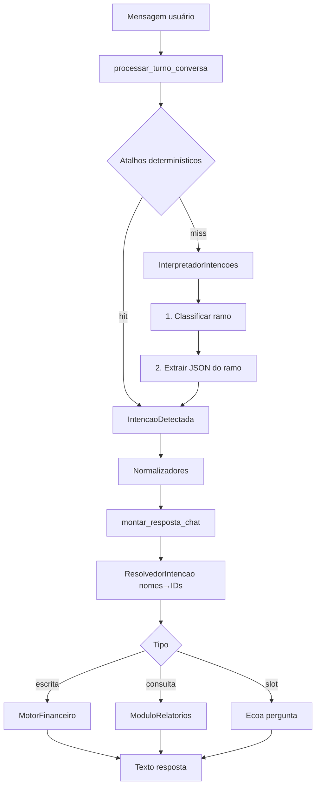

# PRD / Especificação — Pipeline de linguagem natural (lançamentos e consultas)

> ## ⚠️ DOCUMENTO SUBSTITUÍDO
>
> Conteúdo redistribuído no conjunto numerado em [`docs/`](../00-VISAO_DA_ARQUITETURA.md):
>
> - Pipeline do turno, contexto, ramos, atalhos, normalizadores: [10-IA.md](../10-IA.md)
> - Regras de negócio conversacionais: [09-REGRAS_DE_NEGOCIO.md](../09-REGRAS_DE_NEGOCIO.md)
> - Catálogo de intenções e invariantes: [08-CONTRATOS.md](../08-CONTRATOS.md)
> - Jornadas de referência: [05-PRD.md](../05-PRD.md)
> - Gaps conhecidos, agora como backlog técnico: [06-ROADMAP.md](../06-ROADMAP.md)
> - Mapa de arquivos: [03-MODULOS.md](../03-MODULOS.md)
>
> Mantido apenas para consulta histórica. Não atualizar.

Documento para outro agente (ou time) entender e melhorar como o LançAI transforma mensagens em português em intenções estruturadas e respostas financeiras.

**Escopo:** chat HTTP + WhatsApp (Evolution).  
**Fora de escopo deste doc:** UI web detalhada, billing, autenticação completa.

**Código de referência (fonte da verdade):**
- Turno: `apps/api/src/servicos/processar-turno-conversa.ts`
- Intenções: `pacotes/tipos/src/intencoes.ts`
- IA: `modulos/ia/`
- Motor: `modulos/financeiro/`
- Relatórios: `modulos/relatorios/`

---

## 1. Objetivo do produto

Permitir que o usuário controle finanças por WhatsApp/chat com linguagem natural:

1. **Registrar** gastos/receitas (“gastei 45 no Uber no Nubank”).
2. **Consultar** saldos, históricos, totais e extratos (“quanto gastei esse mês?” → depois “detalhado”).
3. **Corrigir / excluir** lançamentos (com confirmação e desambiguação).
4. **Cadastrar** contas/cartões (slot-filling).
5. **Orçamento** e **recorrências** (assinaturas mensais).

Princípio central: a LLM **não escreve no banco** nem calcula saldos. Ela só produz JSON de intenção; regras de negócio ficam no backend.

---

## 2. Arquitetura em camadas (não negociável)



| Camada | Responsabilidade | O que NÃO faz |
|--------|------------------|---------------|
| Atalhos zero-LLM | Patterns óbvios sem custo de tokens | Regras de saldo/limite |
| InterpretadorIntencoes | Classificar + extrair `IntencaoDetectada` | Validar negócio, inventar IDs |
| Normalizadores | Defaults, enxugar descrição, slot-filling | Persistência |
| ResolvedorIntencao | Nomes → IDs; ambiguidade; confirmações | Cálculo financeiro |
| MotorFinanceiro | Criar/corrigir movimentos, saldos, auditoria | Interpretar NL |
| ModuloRelatorios | Agregar leituras (histórico, saldos…) | Formatar tom de voz (API formata) |

ADRs implícitos no código/documento-mestre:
- **ADR-002:** cálculos e validação no motor.
- **ADR-003:** IA só gera estrutura tipada; zero side-effect no DB.

---

## 3. Entradas

### 3.1 Chat HTTP
- `POST /chat` — `{ usuarioId, mensagem, sessaoId? }`
- Sessão nova se `sessaoId` omitido (web).

### 3.2 WhatsApp
- Webhook Evolution → identifica usuário por `whatsapp_numero`.
- Reusa sessão ativa.
- Mídia:
  - Áudio → STT (Groq Whisper) → texto no turno.
  - Foto/PDF → visão de comprovante → pode injetar `intencaoPrevia` (`REGISTRAR_MOVIMENTO`).

---

## 4. Pipeline de um turno (ordem exata)

Arquivo: `processar-turno-conversa.ts`.

1. Obter/criar sessão.
2. Montar **contexto** (antes de gravar a mensagem atual).
3. **Senha de cartão** (se o histórico pediu senha e a msg parece senha) → return precoce.
4. Gravar mensagem do usuário.
5. **Menu** (`menu` / `ajuda`) → resposta fixa; return precoce.
6. Confirmação de **exclusão/desambiguação** (número / sim / não / todos).
7. Confirmação de **duplicata** de lançamento.
8. Atalhos (na ordem):
   1. `interpretar_pedido_detalhe_historico` (“detalhado”)
   2. `interpretar_orcamento_rapido`
   3. `interpretar_recorrencia_rapida`
   4. `interpretar_correcao_rapida` (exclusão com código/termo)
   5. `interpretar_consulta_rapida`
   6. `interpretar_lancamento_rapido`
9. Se nenhum atalho → **LLM** (`InterpretadorIntencoes`).
10. Normalizadores (movimento → cadastro → recorrência → plásticos).
11. Persistir intenção (`papel: ia` + `intencaoDetectada`).
12. `montar_resposta_chat` → texto.
13. Persistir resposta (`papel: sistema`).
14. Enviar (WhatsApp) / retornar JSON (HTTP).

---

## 5. Contexto enviado à IA

`ContextoInterpretacao` (`modulos/ia/src/prompt.ts`):

| Campo | Uso |
|-------|-----|
| `dataAtual` | Resolver “hoje/ontem/esse mês” |
| `contas[]` | `{ nome, perfil }` |
| `cartoes[]` | `{ nome, perfil, modalidade, temConta }` |
| `categorias[]` | Lista canônica (garantida por seed/padrão) |
| `pessoas[]` | Nomes conhecidos |
| `habitos[]` | Ex.: `cartao_principal` |
| `historicoRecente` | Até 8 msgs U/S (prompt usa 2–4) |
| `intencaoPendente` | Slot-filling (dados já capturados) |
| `nomeUsuario` | Perguntas pessoais (“Deividy, qual é o valor?”) |

A IA deve **usar nomes do contexto** (não inventar conta/cartão). Conta/cartão **não** são auto-criados no registro — se não existir, falha ou pergunta.

---

## 6. Catálogo de intenções

Union em `pacotes/tipos/src/intencoes.ts` (17 variantes).

### 6.1 Escrita / movimento
- **`REGISTRAR_MOVIMENTO`** — gasto/receita/transferência.  
  Campos: `tipo_movimento`, `valor?`, `descricao`, `data_movimento?`, `perfil?`, `conta_nome?` **ou** `cartao_nome?`, `categoria_nome?`, `forma_pagamento?`, `parcelas?`, `confirmado?`.
- **`CORRIGIR_MOVIMENTO`** — alterar campos **ou** excluir (`status: cancelado`).  
  `referencia`: `descricao` | `codigo` | `indice` | `data_movimento`.

### 6.2 Consulta
- **`CONSULTAR_VISAO`** — `tipo_visao` ∈  
  `saldos | cartoes | parcelamentos | categoria | futuro | fluxo | evolucao | historico`  
  + `filtros` (período, descrição/estabelecimento, conta, cartão, categoria, perfil)  
  + `detalhado?` (histórico: lista vs só totais).

### 6.3 Cadastro
- `CRIAR_CONTA`, `CRIAR_CARTAO`, `CORRIGIR_CONTA`, `CORRIGIR_CARTAO`, `CONSULTAR_DADOS_CARTAO`.

### 6.4 Orçamento / recorrência
- `DEFINIR_ORCAMENTO`, `CONSULTAR_ORCAMENTO`
- `CRIAR_RECORRENCIA`, `LISTAR_RECORRENCIAS`, `CANCELAR_RECORRENCIA`

### 6.5 Meta
- **`SOLICITAR_INFORMACAO`** — falta campo; `intencao_pendente` + `pergunta` + `dados_parciais`.
- **`MENU`** — só atalho determinístico.
- **`NAO_RECONHECIDA`** — fora do domínio **ou** (hoje) cancelamentos amigáveis (“Exclusão cancelada”).

---

## 7. Ramos do classificador LLM

Antes de extrair o JSON completo, classifica em um ramo (`ramos-intencao.ts`) para reduzir schema/tokens:

| Ramo | Intenções do schema |
|------|---------------------|
| `registrar` | REGISTRAR_MOVIMENTO, SOLICITAR_INFORMACAO, NAO_RECONHECIDA |
| `consultar` | CONSULTAR_VISAO, CONSULTAR_DADOS_CARTAO, CONSULTAR_ORCAMENTO, LISTAR_RECORRENCIAS, NAO_RECONHECIDA |
| `corrigir` | CORRIGIR_MOVIMENTO, CORRIGIR_CONTA, CORRIGIR_CARTAO, NAO_RECONHECIDA |
| `cadastro` | CRIAR_*, CORRIGIR_*, SOLICITAR_INFORMACAO, NAO_RECONHECIDA |
| `orcamento` | DEFINIR/CONSULTAR_ORCAMENTO, NAO_RECONHECIDA |
| `recorrencia` | CRIAR/LISTAR/CANCELAR_RECORRENCIA, SOLICITAR_INFORMACAO, NAO_RECONHECIDA |
| `outro` | só NAO_RECONHECIDA |

**Slot-filling:** se há `intencaoPendente` e a mensagem “parece resposta curta” (≤40 chars, número, “sim”, etc.), **pula o classificador** e força o ramo da pendência.

Provedores: Groq (default) → fallbacks Gemini/Ollama/OpenRouter/OpenAI conforme env. Ver `orquestrador-ia.ts`.

---

## 8. Regras de negócio conversacionais (produto)

### 8.1 Lançamentos
1. Mensagem vaga sem valor (“fiz mercado”) **não** é `NAO_RECONHECIDA` — vira registro incompleto → pergunta valor.
2. **Descrição limpa:** só bem/marca/estabelecimento. Remover:
   - Vocativo do bot (LançAI / STT “Lanç í”)
   - Forma de pagamento (Pix, TED…) → campo `forma_pagamento`
   - Valor, “reais”, data, nome da conta/cartão, “uso pessoal”
3. Defaults de pagamento: cartão sem “débito” → `credito`; conta sem forma → `pix`.
4. Perfil: texto da mensagem (“uso pessoal” / “da empresa”) > perfil da conta/cartão > hábito/padrão.
5. Origem: texto da mensagem > hábito (`cartao_principal`/`conta_principal`) > única conta/cartão cadastrada.
6. Duplicata exata → pergunta se registra de novo (`confirmado`).
7. Categorias: mapear estabelecimentos conhecidos (Uber→Transporte, iFood→Alimentação); **não** criar categoria “Uber”.

### 8.2 Perguntas curtas (slot-filling UX)
- Um campo por vez, tom pessoal se houver nome:  
  `Deividy, qual é o valor?` / `Em qual conta ou cartão?`
- Ordem típica movimento: **valor → conta/cartão → perfil**.
- Ordem recorrência: **valor → dia → descrição → conta/cartão**.
- Cadastro conta: nome → saldo → perfil.  
  Cartão: nome → perfil → (débito: conta) ou (crédito: limite → fechamento → vencimento).

### 8.3 Consultas de histórico
| Tipo de pergunta | Comportamento |
|------------------|---------------|
| “Quanto gastei…”, “total”, “resumo” | Só totais + hint: diga `"detalhado"` |
| “Extrato”, “liste”, “quais”, “mostra lançamentos” | Lista completa |
| Só `"detalhado"` no turno seguinte | **Reusa** filtros/período da última `CONSULTAR_VISAO` histórico |

Filtros comuns: período (hoje/ontem/esse mês/DD/MM), estabelecimento (`descricao`), conta/cartão, categoria.

### 8.4 Corrigir vs excluir (crítico)
| Frase do usuário | Intenção |
|------------------|----------|
| corrige / altera / muda / troca descrição ou valor | `CORRIGIR_MOVIMENTO` com campos novos — **nunca** `status: cancelado` |
| apaga / exclui / cancela / deleta lançamento | `status: cancelado`, `confirmado: false` até confirmar |

**Desambiguação:** vários lançamentos semelhantes → lista numerada (1, 2, …) sem `#código` na copy.  
- Lista de exclusão: “Qual deseja excluir?” → `1`/`2`/`todos`  
- Lista de correção: “Qual deseja corrigir?” → `1`/`2` **altera**, não apaga  

### 8.5 Recorrências
- Padrão: mensal no `dia_do_mes` (1–31).  
  Ex.: `Todo mês dia 10 Netflix 55,90 no Nubank`.
- Sem valor → perguntar `Qual é o valor?` (não falhar com “valor não informado”).
- Cron backend materializa os lançamentos (`POST /cron/recorrencias`).

### 8.6 Orçamento
- Definir limite geral ou por categoria.
- Consultar status.
- Após despesa, pode anexar alerta de estouro na confirmação do lançamento.

---

## 9. Atalhos zero-LLM (quando evitar LLM)

| Atalho | Exemplos que pegam | Exemplos que NÃO pegam (vão pra LLM) |
|--------|--------------------|--------------------------------------|
| Lançamento rápido | “gastei 45 no uber no nubank” | “reais” na frase; “dia 10” ambíguo; sem conta resolvível |
| Consulta rápida | “quanto gastei esse mês?”, “saldo do Nubank”, “lançamentos de hoje” | “quanto gastei de uber?” sem período |
| Pedido detalhado | “detalhado” após um total | sem consulta de histórico anterior |
| Correção rápida | “apague o lançamento #a1b2…” / termo + data | “corrige o almoço para 20” |
| Recorrência | “todo mês dia 10 Netflix 55” | frases muito abertas |
| Orçamento | “orçamento de alimentação 800” | — |
| Menu | “menu”, “ajuda” | — |

**Meta de melhoria:** ampliar atalhos determinísticos para baratear tokens e reduzir latência, sem perder precisão.

---

## 10. Normalizadores pós-IA / pós-atalho

Ordem: `normalizar_intencao_movimento` → `normalizar_intencao_cadastro` → `normalizar_intencao_recorrencia` → `normalizar_intencao_plasticos`.

Responsabilidades principais:
- Completar data/origem/forma/perfil.
- Converter intenção incompleta → `SOLICITAR_INFORMACAO`.
- Mesclar `dados_parciais` da pendência (**cadastro e recorrência sim**; **movimento ainda frágil** — ver gaps).
- Enxugar descrição.

---

## 11. Execução e formatação

### Escrita
`montar_resposta_chat` → `ResolvedorIntencao` → `MotorFinanceiro` → texto de confirmação  
(+ alerta de orçamento / aprendizado de hábitos).

### Consulta
Resolvedor resolve filtros → `ModuloRelatorios.consultar_visao` → `montar_resposta_visao`  
Histórico detalhado: lista por dia com `+/−`, conta/cartão, descrição; limite de itens com rodapé pedindo intervalo menor.

### Slot
Resposta = `intencao.pergunta` (já personalizada).

---

## 12. Jornadas de referência (aceitação)

### J1 — Lançamento completo
`gastei 45 no uber no nubank`  
→ REGISTRAR → “Despesa de R$ 45,00 registrada em Uber…”

### J2 — Lançamento sem valor
`gastei no uber no nubank`  
→ `Deividy, qual é o valor?` → `45` → registra.

### J3 — Total depois detalhe
`quanto gastei esse mês?`  
→ totais + “diga detalhado”  
→ `detalhado`  
→ mesma consulta com lista de lançamentos.

### J4 — Exclusão ambígua
`apague o uber` (2 matches)  
→ lista 1/2 → `1` → cancela só o escolhido (após confirmação se aplicável).

### J5 — Correção ≠ exclusão
`corrige a descrição do tênis` → lista de correção → `1` → **altera**, não apaga.

### J6 — Recorrência incompleta
`Todo mês dia 10 Netflix no Nubank`  
→ `Deividy, qual é o valor?` → `55,90` → cria recorrência.

---

## 13. Gaps conhecidos (oportunidades de melhoria)

Use esta lista como backlog técnico para o outro agente:

1. **Slot de lançamento sem merge determinístico de `dados_parciais`** — depende do LLM + ramo forçado; cadastro/recorrência são mais robustos.
2. Atalho de lançamento recusa frases com “reais” / “dia N” → sobe custo LLM.
3. Consulta por estabelecimento sem período sempre LLM.
4. Correção de valor/descrição sem atalho zero-LLM.
5. `NAO_RECONHECIDA` sobrecarregada (cancelamentos amigáveis misturados com “fora do domínio”).
6. Ramos `fluxo` / `futuro` / `evolucao` / `parcelamentos` pouco cobertos por atalho.
7. Classificador errando `outro` em frases de gasto vagas.
8. Limite de itens no histórico de relatório — UX de “peça intervalo menor”.
9. Documentação antiga ainda fala “WhatsApp no futuro” — código já tem.

---

## 14. Contratos que qualquer melhoria deve respeitar

1. **Não** deixar a LLM gravar/atualizar DB diretamente.
2. **Não** inventar valor, conta ou cartão inexistente.
3. Preferir **perguntar** a falhar com erro técnico.
4. Separar rigidamente **corrigir** vs **excluir**.
5. Manter schemas Zod em `pacotes/tipos` como contrato da IA.
6. Preferir atalho determinístico quando precisão ≥ LLM e custo ↓.
7. Respostas de slot: **curtas**, um campo, opcionalmente com primeiro nome.
8. Testes unitários nos atalhos/normalizadores (`modulos/ia/src/__testes__`, `apps/api/src/__testes__`).

---

## 15. Mapa de arquivos para o agente implementador

```
apps/api/src/servicos/processar-turno-conversa.ts   # orquestra o turno
apps/api/src/montar-resposta-chat.ts
apps/api/src/montar-resposta-visao.ts
apps/api/src/interpretar-confirmacao-exclusao.ts
apps/api/src/interpretar-confirmacao-duplicata.ts
apps/api/src/servicos/interpretar-orcamento-recorrencia-rapido.ts
apps/api/src/servicos/orcamento-servico.ts
apps/api/src/servicos/recorrencia-servico.ts

pacotes/tipos/src/intencoes.ts

modulos/ia/src/interpretador-intencoes.ts
modulos/ia/src/ramos-intencao.ts
modulos/ia/src/prompt.ts
modulos/ia/src/prompt-ollama.ts
modulos/ia/src/orquestrador-ia.ts
modulos/ia/src/interpretar-lancamento-rapido.ts
modulos/ia/src/interpretar-consulta-rapida.ts
modulos/ia/src/interpretar-correcao-rapida.ts
modulos/ia/src/consulta-historico-detalhada.ts
modulos/ia/src/normalizar-intencao-movimento.ts
modulos/ia/src/normalizar-intencao-cadastro.ts
modulos/ia/src/normalizar-intencao-recorrencia.ts
modulos/ia/src/normalizar-descricao.ts
modulos/ia/src/personalizar-pergunta.ts
modulos/ia/src/resolvedor-intencao.ts
modulos/ia/src/montar-lista-semelhantes.ts

modulos/financeiro/src/motor-financeiro.ts
modulos/relatorios/src/modulo-relatorios.ts
```

---

## 16. Como usar este doc com outro agente

Prompt sugerido para o agente melhorador:

> Leia `docs/prd-pipeline-nl-financeiro.md` e o código listado na seção 15.  
> Proposta: melhorar [X — ex.: slot-filling de REGISTRAR_MOVIMENTO / atalhos de consulta por estabelecimento / correção rápida].  
> Respeite a seção 14 (contratos). Entregue: (1) diagnóstico, (2) design, (3) diff mínimo com testes, (4) riscos de regressão nas jornadas J1–J6.

---

*Gerado a partir do código da branch `cursor/lancai-mvp-setup` (Ago/2026). Em caso de divergência, o código prevalece.*
