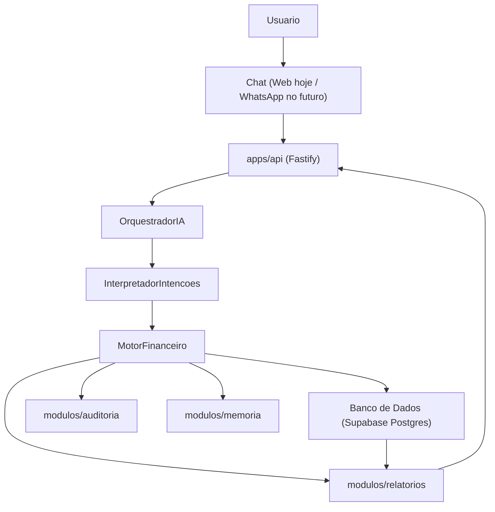

# Documento Mestre — LançAI

Esta é a única fonte da verdade (*single source of truth*) do projeto. Ela substitui e resolve os conflitos entre as duas versões de especificação anteriores (V1 e V2). Qualquer decisão de arquitetura, nomenclatura ou modelo de dados deve seguir este documento.

---

## 1. Visão do produto

O **LançAI** é uma plataforma conversacional de inteligência financeira. O usuário controla toda a sua vida financeira — pessoal e empresarial — enviando mensagens em linguagem natural (texto, futuramente áudio/WhatsApp), sem preencher formulários ou abrir planilhas.

Exemplos de uso:

- "Gastei R$ 185 de combustível ontem no Nubank."
- "Recebi R$ 2.500 do João hoje."
- "Corrige o combustível de ontem para R$ 210."
- "Quanto tenho comprometido até dezembro?"
- "Paguei o churrasco do Marcio com o Mercado Pago da empresa."
- "Comprei a passagem da Iberia em 5x no meu Nubank pessoal, mas foi da empresa."

### Público-alvo do MVP

Pessoas que precisam controlar, ao mesmo tempo: finanças pessoais, pequenas empresas, trabalho autônomo — incluindo cartões pessoais e empresariais, pagamentos cruzados entre pessoa física e empresa, parcelamentos e compromissos futuros.

### Problema que resolve

- Apps financeiros tradicionais têm muita fricção (muitos campos) e são abandonados.
- Apps de IA "simples" só registram gastos básicos e não sustentam controle financeiro completo.
- O LançAI une as duas coisas: a facilidade de conversar com a robustez de um sistema financeiro profissional.

---

## 2. Filosofia do sistema

1. O usuário conversa, nunca preenche formulário.
2. Perguntas mínimas: só perguntar algo se for estritamente necessário para fechar o lançamento.
3. Aproveitamento de contexto: sempre buscar hábitos na `memoria` antes de perguntar.
4. Cadastro incremental: dá para lançar uma despesa sem a categoria existir — o sistema cria/enriquece depois.
5. Conciliação bancária é opcional: prioridade total para o registro rápido via conversa.
6. Divisão de poderes: a IA propõe a intenção (JSON); o `MotorFinanceiro` valida e decide.
7. Toda informação pode ser corrigida por conversa (ex: "altera o valor de ontem para 80").
8. Nada é excluído fisicamente: o sistema é *append-only*. Cancelamentos mudam o `status`, nunca fazem `DELETE`.
9. Toda alteração relevante gera um registro em `auditoria`.
10. Aprendizado contínuo: o sistema conhece melhor o usuário a cada conversa, guardando isso em `memoria` (nunca no contexto da IA).

A IA **não é** o sistema financeiro — é só um interpretador de linguagem. Toda a inteligência financeira (cálculos, validações, regras) vive no `MotorFinanceiro`, no backend. Isso garante: troca de provedor de IA sem alterar o sistema, funcionamento com múltiplos provedores, segurança (a IA nunca escreve no banco) e regras sempre consistentes.

---

## 3. Fluxo de arquitetura funcional



Responsabilidades:

- **Chat**: recebe mensagens do usuário (hoje só Web; WhatsApp é evolução futura).
- **OrquestradorIA**: escolhe qual provedor de IA usar (Gemini, Groq, OpenRouter, Ollama, OpenAI) e cuida do fallback entre eles.
- **InterpretadorIntencoes**: transforma texto (+ contexto de hábitos/cadastros existentes) em uma intenção estruturada em JSON. Nunca escreve no banco.
- **MotorFinanceiro**: valida informações, aplica regras, cria lançamentos, recalcula saldos, gera parcelas, aciona auditoria, responde consultas. É o único componente com autoridade sobre os dados.
- **Banco de Dados**: armazena tudo. A IA nunca acessa o banco diretamente.

---

## 4. Regra de cruzamento Pessoa Física x Empresa (PF x PJ)

**Decisão final**: não existe tabela `empresa`. A separação entre finanças pessoais (PF) e empresariais (PJ) é feita inteiramente pelo campo `perfil` (`'pf'` | `'pj'`), presente em `conta`, `cartao` e `movimento`.

O cruzamento é **apenas classificatório**, para fins de relatório — o MVP **não** cria lançamentos de mútuo/dívida formal entre pessoa física e empresa. Ele apenas permite responder perguntas como:

- "Quanto gastei de pessoal com dinheiro da empresa?" → soma de `movimento` onde `movimento.perfil = 'pf'` e a `conta`/`cartao` usada tem `perfil = 'pj'`.
- "Quanto a empresa gastou com meu cartão pessoal?" → soma de `movimento` onde `movimento.perfil = 'pj'` e a `conta`/`cartao` usada tem `perfil = 'pf'`.

Exemplos concretos:

- *"Pix de R$ 100 de churrasco pro Marcio na conta Mercado Pago (conta da empresa)"* → `movimento.tipo = 'despesa'`, `movimento.perfil = 'pf'`, `conta.perfil = 'pj'` → aparece nos relatórios como gasto pessoal pago pela empresa.
- *"Passagem Iberia de R$ 2.300 em 5x no cartão Nubank pessoal, mas foi da empresa"* → `movimento.tipo = 'despesa'`, `movimento.perfil = 'pj'`, `cartao.perfil = 'pf'` → aparece nos relatórios como gasto empresarial pago com cartão pessoal.

Não há coluna ou tabela extra para isso — é sempre computado em tempo de consulta pelo `modulos/relatorios`.

---

## 5. Dicionário do negócio e padrão de nomes

**Regra crítica**: proibido misturar inglês e português em qualquer nome técnico — tabelas, colunas, classes, funções, rotas de API, nomes de arquivo. Tudo em português.

### Entidades / Tabelas (singular, minúsculo, snake_case)

| Tabela | Descrição |
|---|---|
| `usuario` | Usuário dono da conta |
| `conta` | Local com saldo disponível (Nubank, Caixa, Carteira). Nunca "account". |
| `cartao` | Cartão de crédito (limite, fechamento, vencimento) |
| `categoria` | Classificação do movimento (Alimentação, Combustível...) |
| `pessoa` | Cliente, fornecedor, sócio ou familiar ligado a um movimento |
| `movimento` | Qualquer evento financeiro. Nunca "transação". |
| `parcela` | Desdobramento de um movimento parcelado |
| `memoria` | Conhecimento e hábitos aprendidos do usuário (pertence ao sistema, não à IA) |
| `auditoria` | Registro imutável de alterações |
| `sessao` | Sessão de conversa |
| `chat` | Mensagens trocadas dentro de uma sessão |

Não existe tabela `empresa` (ver seção 4).

### Campos padrão

`id`, `nome`, `descricao`, `valor`, `saldo`, `saldo_inicial`, `saldo_atual`, `tipo`, `status`, `perfil`, `ativo`, `categoria_id`, `cartao_id`, `conta_id`, `usuario_id`, `pessoa_id`, `data_movimento`, `data_lancamento`, `data_criacao`, `data_atualizacao`, `criado_por`, `alterado_por`.

### Convenção de caixa

- Classes/Entidades: `PascalCase` (`Movimento`, `Conta`, `MotorFinanceiro`, `InterpretadorIntencoes`, `OrquestradorIA`).
- Funções/métodos: `snake_case` iniciando com verbo (`criar_movimento()`, `calcular_saldo()`, `registrar_parcelamento()`, `interpretar_mensagem()`).
- Variáveis e colunas do banco: `snake_case`.

---

## 6. Decisões de Arquitetura (ADRs)

- **ADR-001**: Todo nome técnico é escrito em português.
- **ADR-002**: Toda a inteligência e validação matemática/financeira reside exclusivamente no `MotorFinanceiro`.
- **ADR-003**: A IA não possui credenciais de escrita no banco. Ela lê contexto e gera intenções em JSON estruturado.
- **ADR-004**: O sistema é agnóstico a provedor de LLM através da interface `OrquestradorIA`, implementada sobre o Vercel AI SDK.
- **ADR-005**: Histórico de chat e memórias de longo prazo são salvos no banco relacional, nunca no contexto volátil da API de IA.
- **ADR-006**: O core do backend é desacoplado, permitindo que a mesma API atenda o app Web, WhatsApp ou Telegram no futuro.
- **ADR-007**: Não existe tabela `empresa`; a separação PF/PJ é feita via campo `perfil` em `conta`, `cartao` e `movimento` (ver seção 4).
- **ADR-008**: O cruzamento PF/PJ é puramente classificatório (consulta), sem gerar lançamentos de mútuo/dívida no MVP.

---

## 7. Modelo de dados

Todas as tabelas vivem em `pacotes/banco/src/schema`, definidas com Drizzle ORM, com chave primária UUID.

### `usuario`
`id`, `nome`, `email` (único), `ativo`, `data_criacao`, `data_atualizacao`.

### `conta`
`id`, `nome`, `saldo_inicial`, `saldo_atual`, `perfil` (`'pf' | 'pj'`), `ativo`, `usuario_id`, `data_criacao`, `data_atualizacao`.

### `cartao`
`id`, `nome`, `limite`, `fechamento` (dia do mês), `vencimento` (dia do mês), `melhor_dia_compra` (calculado: dia seguinte ao fechamento), `perfil` (`'pf' | 'pj'`), `ativo`, `conta_id` (conta vinculada para débito da fatura), `usuario_id`, `data_criacao`, `data_atualizacao`.

### `categoria`
`id`, `nome`, `tipo` (`'receita' | 'despesa' | 'ambos'`), `ativo`, `usuario_id`, `data_criacao`, `data_atualizacao`.

### `pessoa`
`id`, `nome`, `tipo` (`'cliente' | 'fornecedor' | 'socio' | 'funcionario' | 'familiar'`), `ativo`, `usuario_id`, `data_criacao`, `data_atualizacao`.

### `movimento`
`id`, `descricao`, `valor`, `tipo` (`'receita' | 'despesa' | 'transferencia' | 'reembolso' | 'emprestimo' | 'estorno' | 'retirada' | 'aporte'`), `status` (`'previsto' | 'realizado' | 'cancelado'`), `perfil` (`'pf' | 'pj'`), `data_movimento`, `data_lancamento`, `conta_id` (opcional), `cartao_id` (opcional), `categoria_id`, `pessoa_id` (opcional), `usuario_id`, `data_criacao`, `data_atualizacao`, `criado_por`, `alterado_por` (opcional).

### `parcela`
`id`, `movimento_id`, `numero_parcela`, `valor`, `data_movimento` (vencimento projetado), `status` (`'previsto' | 'realizado' | 'cancelado'`), `data_criacao`, `data_atualizacao`.

### `memoria`
`id`, `chave`, `valor` (texto/JSON), `usuario_id`, `data_criacao`, `data_atualizacao`.

### `auditoria`
`id`, `tabela`, `registro_id`, `acao` (`'INSERCAO' | 'ALTERACAO' | 'CANCELAMENTO'`), `estado_anterior` (JSON), `estado_atual` (JSON), `alterado_por`, `data_criacao`.

### `sessao`
`id`, `usuario_id`, `status` (`'ativa' | 'encerrada'`), `data_criacao`, `data_atualizacao`.

### `chat`
`id`, `sessao_id`, `papel` (`'usuario' | 'sistema' | 'ia'`), `conteudo`, `intencao_detectada` (JSON opcional), `data_criacao`.

---

## 8. Contrato de interface da IA (`InterpretadorIntencoes`)

A IA traduz qualquer frase exclusivamente em um JSON validado por schema Zod (`pacotes/tipos`), nunca em texto livre interpretado manualmente.

### `REGISTRAR_MOVIMENTO`
```json
{
  "intencao": "REGISTRAR_MOVIMENTO",
  "tipo_movimento": "despesa",
  "valor": 180,
  "data_movimento": "2026-07-31",
  "descricao": "Combustível",
  "perfil": "pf",
  "conta_nome": "Nubank",
  "cartao_nome": null,
  "categoria_nome": "Combustível",
  "pessoa_nome": null,
  "parcelas": null
}
```

`conta_destino_nome` é preenchido apenas quando `tipo_movimento = "transferencia"`. Quando o usuário não cita conta/cartão/categoria/pessoa, o campo correspondente vem `null` — a resolução de contexto (Fase 3, `modulos/ia/resolvedor-intencao.ts`) decide o que fazer: categoria vazia vira "Outros"; conta/cartão vazios ficam a cargo do `MotorFinanceiro` (que exige pelo menos um dos dois).

### `CONSULTAR_VISAO`
```json
{
  "intencao": "CONSULTAR_VISAO",
  "tipo_visao": "categoria",
  "filtros": {
    "categoria_nome": "Alimentação",
    "perfil": "pf",
    "periodo": { "de": "2026-08-01", "ate": "2026-08-31" }
  }
}
```

`tipo_visao` aceita: `saldos`, `cartoes`, `parcelamentos`, `categoria`, `futuro`, `fluxo`, `evolucao`.

### `CORRIGIR_MOVIMENTO`
```json
{
  "intencao": "CORRIGIR_MOVIMENTO",
  "referencia": { "descricao": "combustível", "data_movimento": "2026-07-31" },
  "campos_alterados": { "valor": 210 }
}
```

### `CRIAR_CONTA`, `CRIAR_CARTAO` e `SOLICITAR_INFORMACAO` (onboarding conversacional)

Adicionadas para o onboarding 100% conversacional: nenhum formulário, nem terminal — o usuário cadastra contas e cartões conversando, e a IA sabe pedir o que falta.

```json
{ "intencao": "CRIAR_CONTA", "nome": "Nubank", "saldo_inicial": 1200, "perfil": "pf" }
```

```json
{
  "intencao": "CRIAR_CARTAO",
  "nome": "Nubank",
  "limite": 5000,
  "fechamento": 20,
  "vencimento": 27,
  "perfil": "pf",
  "conta_nome": "Nubank"
}
```

Todos os campos de `CRIAR_CONTA`/`CRIAR_CARTAO` são opcionais no schema (**slot-filling flexível**): o usuário pode informar tudo numa frase só, em qualquer ordem, ou aos poucos em várias mensagens. Quando a IA já sabe que o usuário quer criar uma conta/cartão (ou registrar um movimento) mas falta algum campo obrigatório, ela devolve `SOLICITAR_INFORMACAO` em vez de inventar o valor:

```json
{
  "intencao": "SOLICITAR_INFORMACAO",
  "intencao_pendente": "CRIAR_CONTA",
  "pergunta": "Qual o saldo atual dessa conta?",
  "dados_parciais": { "nome": "Nubank", "perfil": "pf" }
}
```

**Não existe estado de "onboarding pendente" persistido no banco.** A cada turno, `apps/api/src/rotas/chat.ts` monta o contexto da IA (`ContextoInterpretacao`, `modulos/ia/src/prompt.ts`) incluindo `historicoRecente` — as últimas mensagens de `chat` com papel `usuario`/`sistema` da sessão atual. É esse histórico que dá à IA a informação de que uma pergunta foi feita no turno anterior, permitindo juntar a resposta curta do usuário (ex.: "R$ 1.200") com a intenção que estava sendo montada. O prompt também recebe `totalContas`/`totalCartoes`, usados para a IA priorizar `CRIAR_CONTA` quando a mensagem for ambígua e o usuário ainda não tiver nenhuma conta.

Resolução e persistência ficam em `modulos/ia/src/resolvedor-intencao.ts` (`resolver_criar_conta`/`resolver_criar_cartao`, que usam `RepositorioContexto.criarConta`/`criarCartao`) — diferente da resolução de `REGISTRAR_MOVIMENTO` (seção 9), aqui a criação de conta/cartão É o objetivo explícito da intenção, não um efeito colateral automático.

Por fim, existe um atalho **determinístico** (sem IA) para "menu"/"ajuda": se a mensagem do usuário for exatamente `menu`, `ajuda`, `/menu`, `/ajuda` ou `help` (case-insensitive), `apps/api/src/rotas/chat.ts` intercepta antes de chamar o `InterpretadorIntencoes` e responde com o texto fixo de `apps/api/src/montar-resposta-menu.ts` — lista de comandos por categoria e contagem atual de contas/cartões. Esse atalho nunca consome cota de nenhum provedor de IA e funciona mesmo se todos estiverem indisponíveis. A intenção sintética `MENU` (`{ "intencao": "MENU" }`) existe no schema só para o retorno da rota ter um formato consistente — a IA nunca a gera.

Existe uma intenção adicional, `NAO_RECONHECIDA` (`{ "intencao": "NAO_RECONHECIDA", "motivo": "..." }`), não prevista nos documentos originais mas necessária como *escape hatch*: evita que o `InterpretadorIntencoes` seja forçado a encaixar uma mensagem fora do domínio financeiro (saudações, perguntas genéricas) em uma das outras intenções.

---

## 9. Regras core do `MotorFinanceiro`

- **Cálculo de saldo**: lançamentos em `conta` com `status = 'realizado'` alteram imediatamente `saldo_atual`. Lançamentos `'previsto'` não afetam saldo, apenas projeções futuras. Direção do impacto por tipo: `receita`/`reembolso`/`estorno`/`aporte` somam; `despesa`/`retirada`/`emprestimo` subtraem (convenção assumida para `emprestimo`: dinheiro saindo da conta de quem empresta — ajustável se o uso real mostrar o contrário).
- **Geração de parcelas**: ao receber um movimento parcelado, o motor cria o movimento original (pai) e uma linha em `parcela` por parcela, dividindo o valor. Se for em `cartao`, a data de vencimento da 1ª parcela respeita o `fechamento`/`vencimento` do cartão (`melhor_dia_compra = fechamento + 1`).
- **Classificação de fluxo cruzado**: calculada em `modulos/financeiro/fluxo-cruzado.ts` (`eh_fluxo_cruzado`) no momento da criação do movimento, comparando `movimento.perfil` com o `perfil` da `conta`/`cartao` usada (ver seção 4), e registrada como metadado (`fluxoCruzado`) dentro do `estado_atual` da linha de `auditoria` correspondente — não é uma coluna própria. `modulos/relatorios` (Fase 5) recalcula/consome essa mesma regra para agregações.
- **Correção de lançamentos** (`MotorFinanceiro.corrigir_movimento`): nunca sobrescreve sem rastro — grava `estado_anterior`/`estado_atual` em `auditoria`. Se o valor de um movimento `'realizado'` associado a uma `conta` (não `cartao`, não `transferencia`) muda, o saldo é ajustado atomicamente pela diferença (`saldo_atual += direção × (valor_novo - valor_antigo)`).
- **Auditoria**: toda inserção/alteração/cancelamento em `movimento` e `parcela` grava uma linha em `auditoria` com `estado_anterior`/`estado_atual`.
- **Append-only**: nenhuma rotina do sistema executa `DELETE` em `movimento`/`parcela`. Cancelamento = mudança de `status` para `'cancelado'`.
- **Resolução de referências da IA** (`modulos/ia/resolvedor-intencao.ts`): traduz os nomes em texto livre devolvidos pela IA para IDs reais. Categoria e pessoa são **criadas automaticamente** quando não existem (cadastro incremental); conta e cartão **nunca** são criados automaticamente — geram erro pedindo confirmação do nome, pois exigem dados que só o usuário pode fornecer (saldo inicial, limite, fechamento etc.).

---

## 10. Casos de teste conceituais (critérios de aceite)

1. *"Gastei R$ 45 no almoço hoje"* → cria `movimento` tipo despesa, busca em `memoria` a conta/cartão mais provável para "almoço", usa categoria "Alimentação".
2. *"Recebi R$ 5.000 do cliente XPTO"* → cria `movimento` tipo receita, associa à `pessoa` "XPTO" (cria se não existir), atualiza `saldo_atual` da conta.
3. *"Comprei uma TV de R$ 3.000 parcelada em 10x no Inter"* → cria o `movimento` pai e 10 `parcela`s com datas futuras.
4. *"Quanto eu gastei com mercado este mês?"* → consulta em `modulos/relatorios`, filtro por categoria + período atual, resposta em texto formatado.
5. *"Pix de R$ 100 de churrasco pro Marcio na conta Mercado Pago (PJ)"* → `movimento.perfil = 'pf'`, `conta.perfil = 'pj'`; aparece em "quanto gastei de pessoal com dinheiro da empresa".
6. *"Corrige o combustível de ontem para R$ 210"* → intenção `CORRIGIR_MOVIMENTO`, gera nova linha de `auditoria` preservando o valor anterior.

---

## 11. Stack tecnológica

| Camada | Escolha |
|---|---|
| Frontend | React + Vite + TypeScript + Tailwind CSS + shadcn/ui |
| Backend | Node.js + Fastify + TypeScript |
| Orquestrador de IA | Vercel AI SDK (`ai`) com providers `@ai-sdk/google`, `@ai-sdk/groq`, `@ai-sdk/openai`, e provider OpenAI-compatível para OpenRouter/Ollama |
| Banco | Supabase (Postgres) + Drizzle ORM |
| Monorepo | pnpm workspaces |
| Validação/contratos | Zod (`pacotes/tipos`) |
| Testes | Vitest |
| Infraestrutura | Docker + Coolify + VPS Hostinger + Caddy |

Provedores de IA disponíveis: Gemini (padrão), Groq, OpenRouter, Ollama, OpenAI — com fallback automático configurável por variável de ambiente, priorizando tiers gratuitos.

---

## 11.1 Fase 4 — `apps/web` (Interface do Chat)

Frontend em React + Vite + TypeScript + Tailwind CSS v4, com componentes de UI
minimalistas escritos à mão seguindo as convenções do shadcn/ui (não foi usado
o CLI interativo do shadcn/ui, mas os mesmos princípios: componentes pequenos,
`class-variance-authority`/`clsx`/`tailwind-merge` para variantes).

* **Autenticação (Supabase Auth):** decisão de arquitetura — **`usuario.id` é
  literalmente o mesmo UUID do `auth.users.id` do Supabase**, sem tabela de
  vínculo extra. Após qualquer login/cadastro bem-sucedido, o frontend chama
  `POST /usuarios/sincronizar` (idempotente: cria o `usuario` se não existir,
  ou apenas devolve o existente) passando `{ id, nome, email }` com o id da
  sessão do Supabase. Isso mantém o `MotorFinanceiro` e toda a API agnósticos
  de como a autenticação é feita.
* **Chat conversacional:** o hook `useChat` do Vercel AI SDK foi
  **descartado de propósito** — ele espera um protocolo de streaming
  token-a-token, mas `POST /chat` devolve uma única resposta já processada
  pelo `MotorFinanceiro` (a IA só é usada no backend para interpretar a
  intenção). Por isso o estado da conversa é local ao componente
  `JanelaChat`, com `sessaoId` mantido em memória para dar continuidade ao
  histórico entre mensagens.
* **Visualização de saldos:** painel lateral (`PainelSaldos`) consulta
  `GET /contas?usuarioId=` e `GET /cartoes?usuarioId=` e é recarregado
  automaticamente sempre que o chat processa uma intenção
  `REGISTRAR_MOVIMENTO` ou `CORRIGIR_MOVIMENTO`.

---

## 12. Estrutura do repositório

```text
lancai/
├── docs/
├── apps/
│   ├── web/
│   └── api/
├── modulos/
│   ├── financeiro/
│   ├── ia/
│   ├── memoria/
│   ├── relatorios/
│   └── auditoria/
├── pacotes/
│   ├── banco/
│   └── tipos/
└── infra/
```

---

## 13. Roadmap sequencial

1. **Infraestrutura & Banco** — monorepo, schema Drizzle, migrations.
2. **Motor Financeiro (core, sem IA)** — cálculo de saldo, criação de movimentos, parcelamento, auditoria, 100% testado.
3. **Orquestrador & Interpretador de IA** — parser de linguagem natural, contexto de cadastros/memória, extensão do motor para todos os tipos de movimento.
4. **Interface do Chat (Web)** — UI conversacional ponta a ponta.
5. **Visões e Inteligência** — módulo de relatórios por linguagem natural.
6. **Integração Omnichannel (pós-MVP)** — áudio, OCR, WhatsApp, extratos, dashboards, alertas, multiempresa/multiusuário, API pública.

O MVP é considerado bem-sucedido quando o usuário conseguir administrar toda a sua vida financeira (pessoal e empresarial) apenas conversando com o sistema.
